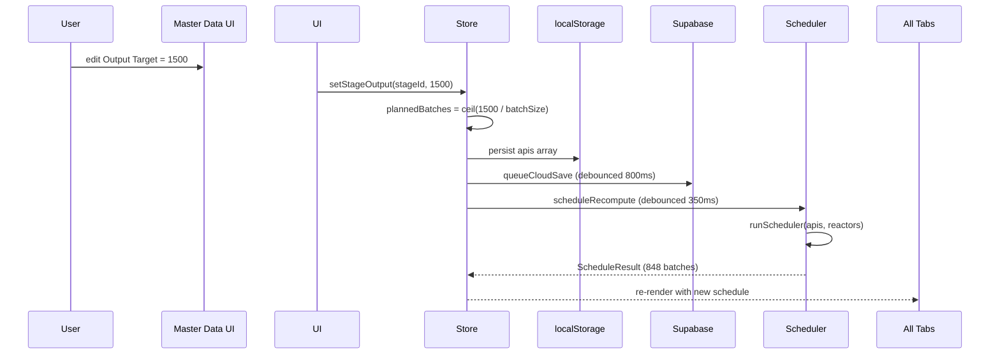

# API Manufacturing Schedule · FY 2026-27

🔗 **Live demo:** https://raviralavgiri.github.io/manufacturing-schedule/

A modern, glassmorphic React webapp that replaces an Excel-based pharmaceutical manufacturing scheduler. Given master data for **20 APIs**, **82 stages**, and **20 reactors** (some shared across stages), it produces an **848-batch yearly schedule** with **zero reactor clashes**, weekly Gantt, equipment heatmap, clash report, and quarterly summary.

## Table of contents

- [What it does](#what-it-does)
- [Tabs](#tabs)
- [How it works](#how-it-works) ← **the algorithm, with examples**
  - [Domain model](#1-domain-model)
  - [The scheduling algorithm](#2-the-scheduling-algorithm)
  - [Worked example: scheduling API-01](#3-worked-example-scheduling-api-01)
  - [Reactor selection — load-balanced earliest-free](#4-reactor-selection--load-balanced-earliest-free)
  - [FY vs Overflow classification](#5-fy-vs-overflow-classification)
  - [What happens when you edit a value](#6-what-happens-when-you-edit-a-value)
  - [Persistence layers](#7-persistence-layers)
- [Run](#run)
- [Cloud persistence with Supabase](#cloud-persistence-with-supabase-optional-free-tier)
- [Build](#build)
- [Tech stack](#tech-stack)
- [File map](#file-map)

---

## What it does

1. Generates **848 batches** sequenced by an equipment-availability algorithm with priority-aware ordering and load-balanced reactor selection
2. Tags each batch as **FY** (Apr 2026 – Mar 2027) or **Ovr** (overflow)
3. Verifies **zero reactor clashes** by construction
4. Renders a **weekly Gantt chart**, **reactor occupancy heatmap**, **clash report**, and **quarterly summary**
5. Lets you **edit master data** (yellow cells) and recomputes the entire schedule in ~350 ms
6. Persists user edits to **localStorage** (always) + **Supabase** (optional, free tier)

## Tabs

| Tab | What you see |
|-----|--------------|
| Master Data | 82-row editable template (yellow = input, lock = derived) |
| Schedule | All 848 batches with start / end / analysis dates, FY & clash flags, CSV export |
| Gantt Chart | Weekly Apr 26 – Mar 27, color per API, faded tail = analysis window. Three modes: by Stage / by API / by Reactor |
| Equipment | 20-reactor × 52-week occupancy heatmap, util bars, weekly fleet trend |
| Clash Report | Zero-clash hero + sequencer explanation + shared-reactor proof |
| Quarterly Summary | Pivot (API × Stage × Q1–Q4 + FY total) + bar chart + treemap |

---

## How it works

This section is the deepest documentation in the repo. It explains every concept, the algorithm, and walks through one full real schedule trace.

### Mental model: pool = reactor TRAIN, not fungible set

> **The most important thing to understand:** when a stage's `reactorPool` lists multiple reactors, **every batch of that stage locks ALL of them simultaneously** for the cycle window. The pool is a *production train* (e.g. synthesis reactor + crystallizer + dryer), not a set of equivalent reactors.

#### Concrete example

> Pool `[R101, R102, R103]` for a stage with **10 batches**, cycle 96 h, analysis 24 h. 
> 
> - Batch 1: locks R101+R102+R103 from week 1 → end of week 1 (96 h)
> - Batch 2 cannot start until **all three** are free → starts immediately after batch 1 ends. Total 10 batches × ~96 h ≈ **40 days serial**.
> - Even though there are 3 reactors, **only one batch runs at a time** for this stage.
> - But: a *different* stage's batch with pool `[R104, R105]` can run in parallel during this whole time.

#### Why this matters
- Total throughput is bounded by `cycleHours × plannedBatches` per stage train, not by `reactor count ÷ pool size`.
- Shared reactors (one reactor in multiple stages' pools) become heavy serialization points — when API-A's S2 needs R107 and API-B's S1 also needs R107, one waits.
- Smaller train sizes (1–2 reactors) → higher throughput. Larger trains (3+) → fewer parallel batches but more equipment per batch.

### 1. Domain model

There are exactly four kinds of objects in the system:

```
┌────────┐ 1..*  ┌──────────────┐ 1  *  ┌──────────────────┐ uses 1..*  ┌──────────┐
│  API   │──────▶│ StageMaster   │──────▶│ BatchScheduleEntry │───────────▶│ Reactor  │
│        │       │  (template)   │       │  (computed by      │           │          │
│        │       │               │       │   scheduler)       │           │          │
└────────┘       └──────────────┘       └──────────────────┘           └──────────┘
priority         batchSizeKg            startMs / endMs                  id, class
color            cycleHours              analysisEndMs                    shared flag
                 analysisHours           inFY, clash, outputKg
                 plannedBatches          reactorId
                 reactorPool[]
```

**Concrete TypeScript** (`src/types.ts`):

```ts
export interface API {
  id: string;
  name: string;
  color: string;
  priority: 1 | 2 | 3 | 4 | 5;   // 1 = critical, 5 = lowest
  projectionKg: number;
  stages: StageMaster[];
}

export interface StageMaster {
  id: string;             // e.g. "API-03-S2"
  apiId: string;
  stageNo: number;        // 1, 2, 3, ...
  stageName: string;      // "Intermediate-2", "Final API"
  batchSizeKg: number;
  reactorPool: string[];  // ["R103", "R104", "R105", "R201"]
  cycleHours: number;     // physical reactor occupancy time
  analysisHours: number;  // QC release time AFTER cycle (reactor is free during this)
  plannedBatches: number; // ceil(targetOutputKg / batchSizeKg)  -- derived in UI
}

export interface BatchScheduleEntry {
  batchId: string; apiId: string; stageId: string; batchNo: number;
  reactorId: string;       // primary / lead reactor (= reactorIds[0])
  reactorIds: string[];    // FULL reactor train: every reactor locked together
  startMs: number;         // train cycle start
  endMs: number;           // train cycle end (all reactors free after this)
  analysisEndMs: number;   // analysis window end
  inFY: boolean;           // Apr 1 2026 – Mar 31 2027
  clash: boolean;          // always false (sequencer guarantees this)
  outputKg: number;
}
```

**Why `cycle` and `analysis` are separate:** during the cycle window the reactor is physically occupied. Analysis happens off-reactor (lab). **The reactor is free as soon as cycle ends** — analysis only delays the *next stage* of the same API, not the next batch on the same reactor.

### 2. The scheduling algorithm

The full algorithm runs in `src/scheduler/scheduler.ts → runScheduler(apis, reactors)`. It's an **equipment-availability sequencer (train model)** with three nested loops:

```mermaid
flowchart TD
    Start([runScheduler])
    Sort[Sort APIs by priority<br/>P1 → P2 → P3 → P4 → P5]
    Outer[for round = 0 .. maxBatches]
    Mid[for each API in priorityOrder]
    Inner[for each Stage 1..N]
    Skip{round &lt; stage.<br/>plannedBatches?}
    EarlyStart[earliestStart = max<br/>prev-stage-analysis-end + 4h,<br/>scheduleHorizon]
    PickReactor[trainStart = max<br/>earliestStart, max-of-pool-last-cycle-end]
    Book[Book ALL reactors in pool:<br/>start, start+cycleHours<br/>analysis tail follows]
    UpdateLast[apiStageLastEnd[stage] =<br/>max prev, analysisEnd]
    Done([848 BatchScheduleEntry rows])

    Start --> Sort --> Outer --> Mid --> Inner --> Skip
    Skip -- Yes --> EarlyStart --> PickReactor --> Book --> UpdateLast --> Inner
    Skip -- No  --> Inner
    Inner -- all stages done --> Mid
    Mid -- all APIs done --> Outer
    Outer -- all rounds done --> Done
```

#### 2.1 The three loops in plain English

| Loop | What it iterates | Why |
|---|---|---|
| Outer: **round** | 0 .. (max planned batches across any stage) | Campaign style — batch #1 of every (API, stage) before any batch #2. Spreads load over the year. |
| Middle: **API in priority order** | P1 → ... → P5 | High-priority APIs grab the earliest free reactor slots in each round. |
| Inner: **stage 1..N** | within each API | Stage N+1's batches require Stage N's batch to have finished analysis (waits with a 4-hour transfer buffer). |

#### 2.2 The two hard constraints

The algorithm never violates these two rules:

1. **No reactor clash** — a reactor's `[start, cycleEnd]` windows are non-overlapping. Each new booking is forced to start `≥ max(reactor.lastCycleEnd, …)`.
2. **Stage ordering inside an API** — Stage N+1's batch B can only start after Stage N's batch B has finished its analysis window plus a 4-hour transfer buffer.

These are encoded in this single line:

```ts
const prevStageReady =
  sIdx === 0 ? HORIZON_MS                                   // Stage 1: just wait for horizon
             : apiStageLastEnd.get(api.id)![sIdx - 1] + bufferMs;  // Stage 2+: wait for prev
const earliestStart = Math.max(prevStageReady, HORIZON_MS);
```

`apiStageLastEnd` is a per-API array tracking the max analysis-end so far at each stage index. After every batch is booked, `apiStageLastEnd[stageIdx] = max(apiStageLastEnd[stageIdx], analysisEnd)` so the next stage knows when it can start.

#### 2.3 Helper functions used inside the loop

The algorithm calls a handful of pure helpers from `src/utils/dates.ts`:

```ts
// Convert hours to milliseconds (scheduler works in epoch ms throughout).
export function hoursToMs(h: number): number {
  return Math.round(h * 3600 * 1000);
}

// Returns true if the timestamp falls within FY 2026-27 (Apr 1 2026 – Mar 31 2027).
// Used to set the `inFY` flag on each booked batch so the UI can show "Ovr" badges.
export function isInFY(ms: number): boolean {
  return ms >= FY_START.getTime() && ms <= FY_END.getTime();
}

// Maps a timestamp to a 0..51 week index aligned to FY start.
// Used to bucket batches into the heatmap's 52-column timeline.
export function weekIndexOf(ms: number): number {
  const diffMs = new Date(ms).getTime() - FY_WEEKS[0].start.getTime();
  if (diffMs < 0) return -1;
  const idx = Math.floor(diffMs / (7 * 24 * 3600 * 1000));
  return idx >= WEEKS_IN_FY ? -1 : idx;
}
```

`FY_WEEKS` is a pre-built array of 52 entries (one per ISO week between Apr 1 2026 and Mar 31 2027) used by the UI for Gantt headers, heatmap columns, and quarterly grouping.

### 3. Worked example: scheduling API-03 (train model)

API-03 has 4 stages with **small reactor trains** (1–3 reactors each, deterministic seed):

| Stage | Cycle | Analysis | Reactor Train | Planned Batches |
|---|---|---|---|---|
| **S1** Intermediate-1 | 60 h | 30 h | `[R104, R105]` (2-reactor) | 11 |
| **S2** Intermediate-2 | 72 h | 36 h | `[R107, R108, R201]` (3-reactor) | 11 |
| **S3** Intermediate-3 | 84 h | 48 h | `[R204]` (single-reactor) | 11 |
| **S4** Final API     | 120 h | 60 h | `[R302, R303]` (2-reactor) | 11 |

The horizon is **Apr 1 2026 08:00**. Below is API-03's first batch through all 4 stages (assume R104, R105, R107, R108, R201, R204, R302, R303 are all initially idle):

| Step | Stage | earliestStart | Train ready at | Books cycle | Notes |
|---|---|---|---|---|---|
| 1 | S1·b1 | Apr 1 08:00 | R104=Apr 1, R105=Apr 1 → max=**Apr 1 08:00** | Apr 1 08:00 → Apr 3 20:00 (60 h) on R104+R105 | Both reactors locked together |
| 2 | S2·b1 | S1 analysis end + 4 h = Apr 5 02:00 + 4 = **Apr 5 06:00** | R107=Apr 1, R108=Apr 1, R201=Apr 1 → max=**Apr 5 06:00** | Apr 5 06:00 → Apr 8 06:00 (72 h) on R107+R108+R201 | Stage 2 waited for stage 1's analysis tail |
| 3 | S3·b1 | S2 analysis end + 4 h = Apr 9 18:00 + 4 = **Apr 9 22:00** | R204=Apr 1 → max=**Apr 9 22:00** | Apr 9 22:00 → Apr 13 10:00 (84 h) on R204 | Single-reactor train |
| 4 | S4·b1 | S3 analysis end + 4 h = Apr 15 10:00 + 4 = **Apr 15 14:00** | R302=Apr 1, R303=Apr 1 → max=**Apr 15 14:00** | Apr 15 14:00 → Apr 20 14:00 (120 h) on R302+R303 | Final API train |

Then the loop moves to API-04 (P1) → … → API-20 (P5) → back to **API-03 round 1**. By the time API-03 starts S1 batch 2:
- R104+R105 must both be free at the same time
- They might already be busy because **API-15 also uses [R105, R106]** for its S2 → contention
- API-03 S1 batch 2 starts at the later of: (i) the prev round-0 batch's release time, (ii) train re-availability after sharing — typically several days after batch 1.

#### Why batches are STRICTLY SERIAL within a stage

Even though S1's train has 2 reactors, you cannot run S1 batch 1 and S1 batch 2 in parallel — they need **the same** R104 AND R105 simultaneously. So all 11 batches of S1 happen back-to-back on the train, total ~28 days of S1 train time.

### 4. Reactor selection — train availability with gap-packing

In the train model the reactor selection is straightforward: the pool **is** the train, so there's no "selection" — we compute when the entire train is free **and** find the *earliest free gap* across all reactors in the pool.

```ts
function findTrainSlot(pool: string[], earliest: number, cycleMs: number): number {
  let t = earliest;
  const lookups = pool.map((rid) => reactorBookings.get(rid)!);

  for (let safety = 0; safety < 5000; safety++) {
    let conflictEnd = t;
    let foundConflict = false;
    for (const slots of lookups) {
      for (const slot of slots) {
        if (slot.cycleEndMs <= t) continue;       // entirely before our start
        if (slot.startMs >= t + cycleMs) break;   // entirely after; rest are too (sorted)
        // Genuine overlap — must wait until this slot frees
        if (slot.cycleEndMs > conflictEnd) conflictEnd = slot.cycleEndMs;
        foundConflict = true;
        break;
      }
      if (foundConflict) break;
    }
    if (!foundConflict) return t;
    t = conflictEnd;
  }
  return t;
}
```

Then book the cycle on EVERY reactor in the train, **at the sorted position** so future scans walk slots in chronological order:

```ts
for (const rid of stage.reactorPool) {
  insertSorted(reactorBookings.get(rid)!, { startMs, endMs: analysisEndMs, cycleEndMs });
}
```

#### Why gap-finding is critical (real bug story)

Earlier the algorithm only looked at each reactor's **last booking end**. That broke whenever a high-priority API's late stage forced a booking into the future:

> **Bug scenario:** R107 is in API-01's S4 train. API-01's stage chain (S1 → S2 → S3 → S4) pushes its S4 batch to **week 5**. R107 books `[week 5, week 6]`.
> 
> **Naive algorithm:** When API-02's S1 wants R107 (which is in API-02's S1 pool), `lastEnd = week 6` → books at week 6. **Weeks 0–5 wasted.**
> 
> **Gap-finder:** Walks R107's bookings, sees `[week 5, week 6]` is the only one. Notes that `[week 0, week 5]` is free. Returns `t = week 0`. API-02's S1 books `[week 0, week 1]`.

Real measured impact on the spec data:

| Metric | Before fix (last-end only) | After fix (gap-finder) |
|---|---|---|
| Batches in FY | 304 | **641** |
| Overflow | 544 | **207** |
| Reactor clashes | 0 | 0 |

The gap-finder more than **doubled** the in-FY throughput — same total work, same equipment, just better packing.

Why this is important: in the *previous* (fungible) model the algorithm could pick any one reactor from the pool, so multiple batches could run in parallel on different members of the pool. In the **train model** the entire pool is a single resource — only one batch of the stage runs at a time, regardless of how many reactors are listed. **But** different APIs whose pools share that reactor can interleave around each other's idle windows.

#### Realistic worked example

> Stage S1 of API-03 has pool `[R103, R104]` (2-reactor train), cycle 60 h, planned batches 10.
>
> ```
> Batch 1: R103+R104 busy from Apr 1 08:00 → Apr 3 20:00  (60 h)
> Batch 2: R103+R104 busy from Apr 3 20:00 → Apr 6 08:00  (next slot, no parallelism)
> Batch 3: ...
> ...
> Batch 10: ends ~Apr 26
> ```
>
> R103 is also in API-07 S2's pool `[R103, R201]`. While API-03 S1 has the train locked, API-07 S2 has to wait for R103 — that's how shared reactors create cross-API queueing.

### 5. FY vs Overflow classification

After every booking we tag `inFY`:

```ts
inFY: isInFY(startMs) && isInFY(cycleEndMs),
```

So a batch is in-FY only if **both** its cycle start and cycle end fall inside Apr 1 2026 – Mar 31 2027. If a batch starts March 28 2027 with a 14-day cycle, it **straddles** FY boundary → flagged `Ovr`. The Schedule tab shows these in amber and the global KPIs report `In FY: 645 / Overflow: 203`.

### 6. What happens when you edit a value

When you change any yellow cell, this happens (debounced 350 ms):



Two debounce timers:
- **350 ms** for re-running the scheduler — coalesces rapid keystrokes during a number edit
- **800 ms** for the Supabase upsert — batches multiple edits into one network call

The complete scheduler runs in **~50 ms** end-to-end on a modern laptop, so 350 ms is plenty.

### 7. Persistence layers

The app has three data sources, in priority order on startup:

```
┌───────────────────────────────┐
│  1. Supabase (cloud)          │  ← if VITE_SUPABASE_URL is set, AND user has not started
│     workspaces.apis JSONB     │     editing in this browser session
├───────────────────────────────┤
│  2. localStorage (browser)    │  ← always read on init; written on every edit
│     "pharma:apis:v1"          │
├───────────────────────────────┤
│  3. Seed (in-source code)     │  ← deterministic mulberry32 PRNG, src/data/seed.ts
│     20 APIs, 82 stages        │
└───────────────────────────────┘
```

**Hydration order** (`src/store.ts`):

1. Read `localStorage["pharma:apis:v1"]` — if found, hydrate immediately so first paint is fast.
2. If Supabase is configured, async-fetch the cloud row. If it differs and the user hasn't started editing yet, swap state.
3. If both are empty, fall back to the deterministic seed.

**Write order on every mutation:**

1. Update React state (sub-millisecond)
2. Write `localStorage` (synchronous, instant)
3. Queue debounced Supabase upsert (~800 ms)
4. Schedule recompute (~350 ms debounce, then re-run scheduler)

---

## Run

```bash
npm install
npm run dev
# open http://localhost:5173
```

## Cloud persistence with Supabase (optional, free tier)

The app works without any setup (localStorage only). To make your edits sync
across browsers / devices, plug in a free Supabase project:

### 1. Create a free Supabase project

1. Sign up at [supabase.com](https://supabase.com) (free tier: 500 MB DB, no credit card)
2. Create a new project and pick any password (you won't need it)
3. Wait ~30 seconds for it to provision

### 2. Run the schema migration

1. In your Supabase dashboard, go to **SQL Editor → New query**
2. Paste the contents of [`supabase/schema.sql`](./supabase/schema.sql) and run it
3. Verify the `workspaces` table appears under **Table Editor**

### 3. Grab your project URL + anon key

In your dashboard go to **Settings → API**:
- Copy **Project URL** → `VITE_SUPABASE_URL`
- Copy **anon / public** key → `VITE_SUPABASE_ANON_KEY`

### 4. Configure local dev

```bash
cp .env.example .env.local
# then edit .env.local with your values
npm run dev
```

You should see the **"Cloud ready"** badge in the top-right; edits will show
**"Syncing… → Synced"**.

### 5. Configure the deployed site (GitHub Pages)

Add the same two values as **GitHub repo secrets**:

```bash
gh secret set VITE_SUPABASE_URL    --body "https://YOUR.supabase.co"
gh secret set VITE_SUPABASE_ANON_KEY --body "eyJhbGciOi..."
```

Push any commit to main → the Action picks them up at build time and
deploys with cloud sync enabled.

### Sharing a workspace across devices

Each browser generates a UUID stored in `localStorage["pharma:workspaceId:v1"]`. To use the same workspace on another device:

1. Click the **copy** icon in the Sync badge (top-right) on the source browser
2. On the new browser, open DevTools console and run:
   ```js
   localStorage.setItem("pharma:workspaceId:v1", "PASTE-UUID-HERE");
   location.reload();
   ```

### Security notes

The `anon` key is embedded in the public JS bundle (this is normal for any
client-only Supabase app). The default RLS policies in `schema.sql` allow
anonymous CRUD — fine for a personal demo. For multi-user production, add
Supabase Auth and tighten the RLS policies to `auth.uid() = owner_uuid`.

## Build

```bash
npm run build
npm run preview
```

CI: every push to `main` triggers `.github/workflows/deploy.yml` which builds and publishes to GitHub Pages.

## Tech stack

- **Vite + React 18 + TypeScript**
- **Tailwind CSS v3** (custom dark / glass design system)
- **Zustand** (state, debounced re-scheduler, cloud sync)
- **Recharts** (bar / line / treemap)
- **date-fns** (date math, FY week buckets)
- **lucide-react** (icons)
- **@supabase/supabase-js** (optional cloud persistence)

## File map

```
src/
├── data/
│   └── seed.ts                 Deterministic seed (20 APIs, 82 stages, 20 reactors)
├── scheduler/
│   └── scheduler.ts            Equipment-availability sequencer (Section 2 above)
├── services/
│   ├── supabase.ts             Client init + per-browser workspace UUID
│   └── sync.ts                 Debounced cloud upsert + initial cloud load
├── utils/
│   ├── dates.ts                FY week buckets, hour-to-ms helpers
│   └── storage.ts              Versioned localStorage helpers
├── components/
│   ├── Primitives.tsx          Card, Pill, Tag, SectionHeader
│   ├── PriorityPill.tsx        P1..P5 dropdown badge
│   ├── ReactorPoolEditor.tsx   Popover chip-toggle editor
│   ├── AddStageForm.tsx        Inline form for new stages / new APIs
│   └── SyncBadge.tsx           Cloud-sync status (idle / syncing / synced / error)
├── tabs/
│   ├── MasterDataTab.tsx       Editable template
│   ├── ScheduleTab.tsx         Virtualized 848-row table + CSV export
│   ├── GanttTab.tsx            Weekly Gantt (3 modes)
│   ├── EquipmentTab.tsx        Heatmap + util bars + trend line
│   ├── ClashTab.tsx            Zero-clash hero + sequencer proof
│   └── QuarterlyTab.tsx        Pivot + bar chart + treemap
├── store.ts                    Zustand store (state + actions + sync orchestration)
├── types.ts                    Domain types (API, StageMaster, Reactor, ...)
├── App.tsx                     Top-level shell, header, tab routing
└── main.tsx                    Entry

supabase/schema.sql             One-shot DB migration
.github/workflows/deploy.yml    Build + deploy to GitHub Pages
.env.example                    Documented Supabase env vars
scripts/verify.mjs              Standalone scheduler sanity check (run with: npx tsx scripts/verify.mjs)
```

To run the scheduler standalone (no UI) for sanity-checking after changes:

```bash
npx tsx scripts/verify.mjs
# Output (train model + gap-packing):
#   APIs        : 20
#   Total stages: 82
#   Reactors    : 20
#   Planned bts : 848
#   Scheduled   : 848
#   In FY       : 641   ← gap-finder fits 2x more than the original last-end algorithm
#   Overflow    : 207
#   Clashes     : 0
```
